# gci-OSGeo-WMSTutorial

This page will illustrate the creation of a web map which displays WMS files on Windows.

# Installing Docker

We will be running our geoserver in a container on a Docker container. You can find an open-source version of Docker Toolbox (which should run on any modern PC running Windows) at [this github link](https://github.com/docker/toolbox/releases).

1. Download the .exe file from GitHub
2. Run the .exe file. There will be a prompt to allow an Oracle driver to install; click yes.
3. You should now have Docker Toolbox installed.

# Obtaining some data

So what type of data are you looking for? Try your city/country's Open Data set. I live in Toronto which
releases a good amount of geospatial data on their [open data portal](https://open.toronto.ca/).

The data being used in this tutorial [contains information licensed under the Open Government Licence – Toronto](https://www.toronto.ca/city-government/data-research-maps/open-data/open-data-licence/), which gives me permission to publish their data in this repository.

With that being said, let's dive right in! Say I'm trying to write an article about the condition of TCHC buildings (community housing). We'll download the file from their [webpage](https://ckan0.cf.opendata.inter.prod-toronto.ca/download_resource/f1bf1cef-7d09-407c-80c2-bb2a8b75abfa?format=shp&projection=4326).

# Importing the data to GeoServer

Let's start up GeoServer and feed it this data. We'll be using Docker to run GeoServer. Open up the Docker Quickstart Terminal.

1. Note the IP address, e.g. 192.168.99.100. From now on, we will refer to this as [host_ip]

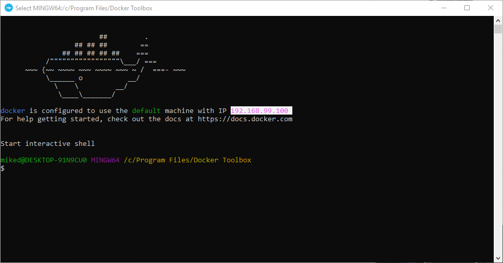

2. In docker, [cd](https://en.wikipedia.org/wiki/Cd_\(command\)) to the directory containing the data directory.

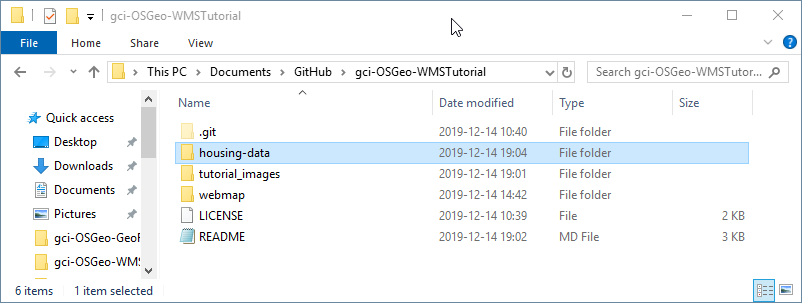

3. Run the following commands sequentially. (I'm in the wrong directory in the terminal, by the way)
  ```
  docker pull kartoza/geoserver
  docker create --name "geoserver" -p 8080:8080  kartoza/geoserver
  ```

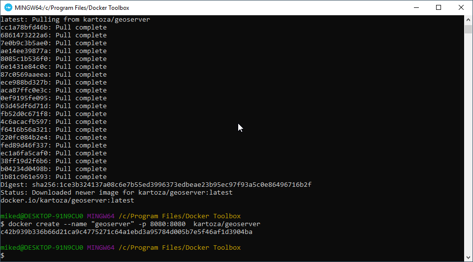
The terminal will give you a 128-byte container ID. You can use any number of leading digits as [con_id] as long as they are unique with other containers.
For example, for a container with ID c42b939b336b66d21ca9c4775271c64a1ebd3a95784d005b7e5f46af1d3904ba, replace [con_id] with 'c', 'c4', 'c42', etc. 

4. Run these two commands as well. Make sure you're in the directory containing your data folder.
  ```
  docker cp  housing-data [con_id]:/app
  docker start -t [con_id]
  ```
Wait for the server to spin up.

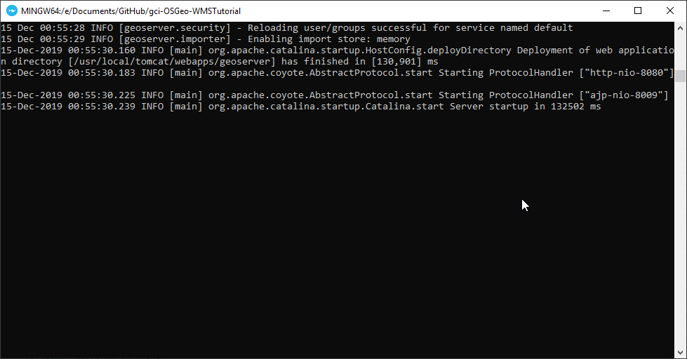

5. Open up the server's admin console at ```[host_ip]:8080/geoserver```
6. Login as admin. The credentials are user: ```admin``` and pw: ```geoserver```

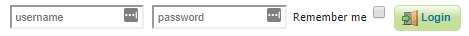

7. Create a new workspace. The name can be anything you want, but I've made mine my GitHub username. 
The URI is an unique identifier, which does not necessarily have to be in the format of an actual URL.

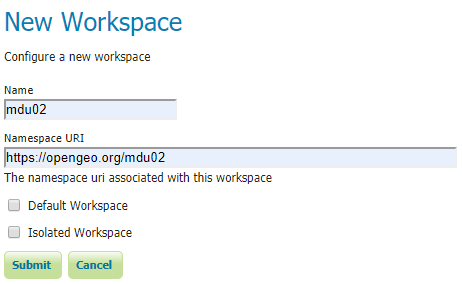

8. Click "Stores" on the left bar, then "Add new Store", then "Shapefile". 
In the file selector, choose the .SHP file that we moved into the container. It will be under the /app directory. Access the root of the container from the dropdown in the top left.

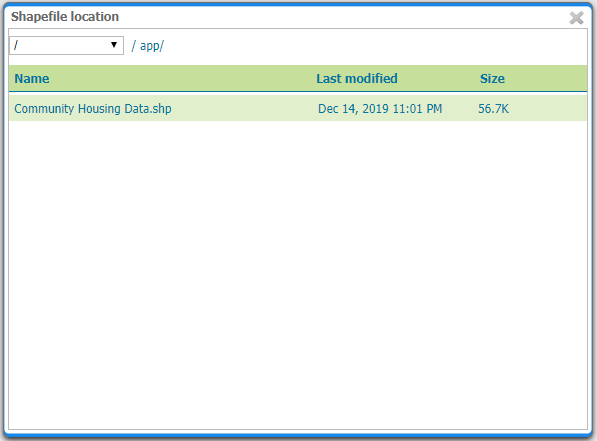

9. Click publish on the next page. Click on 'Compute from Data' and 'Compute from native bounds', then 'Save'. Your data is now ready.

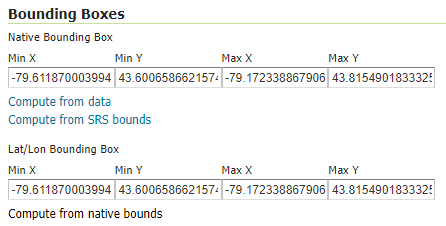

# Troublefixing geoserver problems
If the container crashes, run 
```
docker run -t [con_id]
```
 again.
 
# Creating the Web map
In this section, I will assume you know the basic structure of an [HTML page](https://www.w3schools.com/html/). Therefore, this will just cover how to use WMS to display a page.

1. In the head of the HTML file, include the library and CSS for OpenLayers, as shown below. The latest links will be [here](https://openlayers.org/download/).
```html
<script src="https://cdn.rawgit.com/openlayers/openlayers.github.io/master/en/v6.1.1/build/ol.js"></script>
<link rel="stylesheet" href="https://cdn.rawgit.com/openlayers/openlayers.github.io/master/en/v6.1.1/css/ol.css">
```

2. Create a div. Give it an id, which we will be targeting with the javascript later.
Remember to include CSS to size the div, either here or in the head.
```html
<div id="map" style="width: 900px; height: 600px;"></div>
```

3. Since we have a simple map, we'll just use inline JavaScript. Put in a script tag. Steps 4-6 will be contained within this script tag.
```html
<script type = "text/javascript">
...
</script>
```

4. Create an image layer to serve the community housing locations.
``` javascript
	var housing_img = new ol.layer.Image({
		source: new ol.source.ImageWMS({
		url: '[host_ip]:8080/geoserver/[workspace_name]/wms',
		params: {'LAYERS': '[workspace_name]:[layer_name]'},
		ratio: 1,
		serverType: 'geoserver'
		})
	});
```
In this layer, note a few things. The image object only requires one parameter, the source. 
We create the source, which contains our WMS URL, the layer name, and the type of server.
The WMS URL refers to the workspace name in step 7 of the import step.

5. Create a tile layer, which will serve the underlying map.
```javascript
	var os_layer = new ol.layer.Tile({
		source: new ol.source.OSM({
			url: 'https://tile.openstreetmap.org/{z}/{x}/{y}.png',
			attributions: [ol.source.OSM.ATTRIBUTION],
			maxZoom: 18
		})
	});
```
In this layer, note a few things. Again, the only param is the source. The URL is from OpenStreetMap's tile server. Don't use this in actual app. Read on OSM's usage policy [here](https://operations.osmfoundation.org/policies/tiles/), 
and remember to attribute the data. OpenLayers happens to include a constant to allow you to attribute OSM 

6. Create the map.
```javascript
		var map = new ol.Map({
			layers: [os_layer, housing_img],
			target: 'map',
			view: new ol.View({
				center: ol.proj.fromLonLat([-79.3832, 43.6532]),
				maxZoom: 18,
				zoom: 11
			})
		});
```
Note a few things. The Map object is the basic object of the OpenLayers library. It contains a few layers, the ones we just created. It targets 'map', the itemid of our map div.
It contains a view, which specifies where in the world the map will display. ```[-79.3832, 43.6532]``` is the coordinates of downtown Toronto.

# Trying everything out
At this point, you should be able to open your html file, which can display a map with a layer above, being served through WMS from a geoserver.
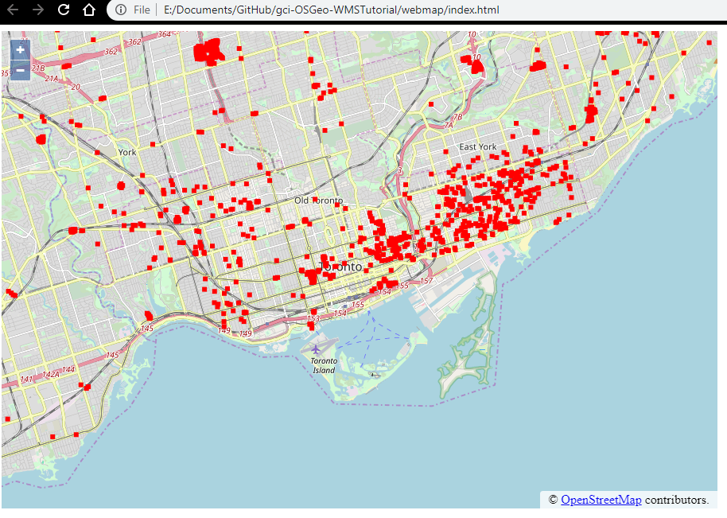

# Extending the project: CQL Filters!
At this point, you might be trying to play with the data. For example, you might want an element on the page that lets you filter only, say, buildings from after 1990.
We can do this with CQL filters! Let's start out by looking at the column names. As it turns out, whoever created the .shp file didn't put the proper field names. But at least they left us a table.

field|name
------|------
FIELD_1|_id
FIELD_2|OBJECTID
FIELD_3|BLD_ID
FIELD_4|DEV_ID
FIELD_5|DEV_NAME
FIELD_6|NGHBRHD_NUM
FIELD_7|POLICE_DIV
FIELD_8|PSTL_CODE
FIELD_9|TTL_RES_UNIT
FIELD_10|MRKT_UNIT
FIELD_11|RGI_UNITS
FIELD_12|YR_BUILT
FIELD_13|BLD_TYPO
FIELD_14|SCATTERED
FIELD_15|BLD_FORM
FIELD_16|FLR_ABV_GR
FIELD_17|BLD_DESC
geometry|geometry

So we can use these fields to filter through CQL.

For those unfamiliar, CQL is a query language which GeoServer supports.
Therefore, we can change the locations served to us through WMS. We can do with our above code by adding another param to params in our ImageWMS.

If we were to add, say 
```
'cql_filter': 'FIELD_12 > 1990'
```
we would obtain only the housing built after the 90s. The code is in /webmap-cql/After 1990
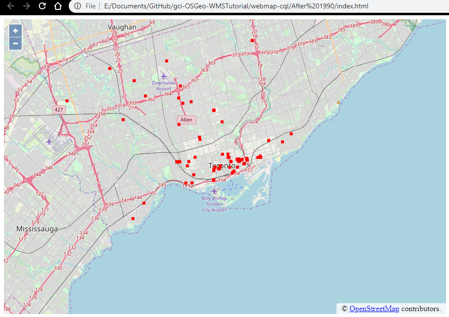

Looks like the city hasn't done much in terms of building community housing in the past 30 years. Draw whatever conclusions you wish.

While we're there, let's have some fun with the filters. As we see above, the CQL filter is simply text. Why don't we make an input box that lets us change the filtered dates?

(As it turns out, the data shows us one particular house built in 1870. I'm not sure if this is a data entry error, but that's not our job as mapmakers).

1. Create a new div in the html that contains two simple input boxes: once for the beginning date and one for the end date.
```html
<div>
Start Date
<input type = "text" id = "sdate" value = "1870"/>
End Date
<input type = "text" id = "edate" value = "2019"/>
</div>
```
which will display two text boxes.

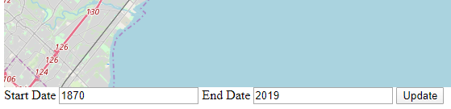

2. Create a function in the javascript that fetches the current value from the input boxes and changes the cql_filter parameter	
```javascript
function update(){
	sdate = document.getElementById("sdate").value;
	edate = document.getElementById("edate").value;
	myfilter = 'FIELD_12 BETWEEN ' + sdate + ' AND ' + edate;
	housing_img.getSource().updateParams({
	'cql_filter': myfilter
	});
}
```

3. Go back to the html div and add a button which calls this update.
```html
<button onClick="update()">Update</button>
```

4. Open up the page. By changing the values at the bottom and pressing update, you can make various different queries about Toronto's community housing data. Here's an example!
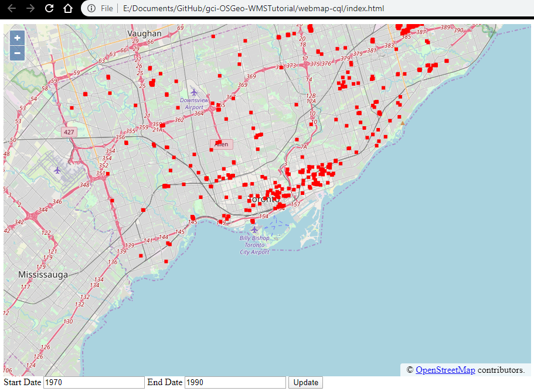
